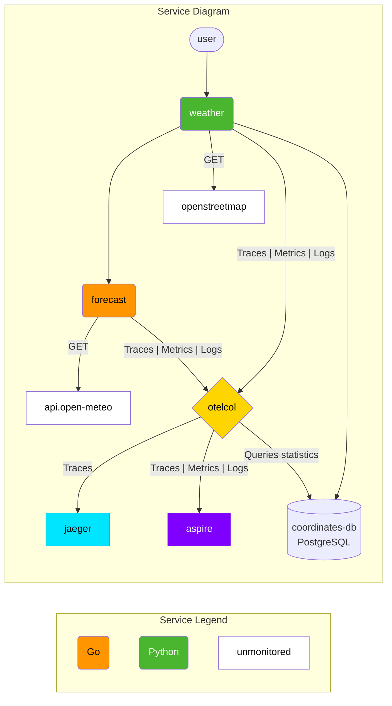

# OTel Lab

This lab was created to demonstrate OpenTelemetry.

The [lab](lab) folder contains the blueprint of all services, as well as an empty
configuration of the OpenTelemetry Collector.

It also contains a step-by-step `README` that will guide you through the instrumentation
and configuration process.

The [solution](solution) folder contains the final state of the lab, with all services
instrumented and OpenTelemetry Collector configured.

## Lab Details

The Lab contains an application composed of 2 services, plus a Postgres database:

- Weather (Python) - Users can query the weather for a specific location.
  - The service exposes 2 endpoints:
    - `/weather/<location>/<country>`
      - eg: <http://localhost:8080/weather/Linz/Austria>
    - `/weather/coordinates/<latitude>/<longitude>`
      - eg: <http://localhost:8080/weather/coordinates/48.3059078/14.286198>
- Forecast (Go) - Receives a call from `Weather` and returns the forecast for
the requested location.
  - It is only accessible by containers running on the same network. Not exposed
  publicly.
- Coordinates-DB (Postgres) - Stores coordinates for locations already queried by
the user.

It also contains some tools that will help you navigate the data:

- OpenTelemetry Collector (otelcol):
  - The Collector receives traces, metrics, and logs as OTLP data from the `weather`
  and `forecast` services, as well as queries the [PostgreSQL statistics collector][1].
  - It processes the data and exports it as OTLP data to Jaeger (traces) and Aspire
  (traces, metrics, and logs).
- Jaeger is used to receive and visualize traces:
  - Accessible at: <http://localhost:16686/>
- Aspire Dashboard is used to receive and visualize traces, metrics, and logs:
  - Accessible at: <http://localhost:18888/>

## Lab Diagram

[1]: https://www.postgresql.org/docs/13/monitoring-stats.html