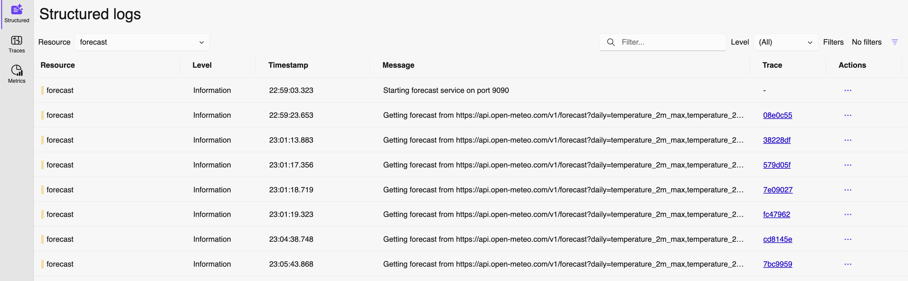

# Forecast Service Instrumentation

The Forecast service is written in Go. In this section, we will
add everything needed to instrument it and obtain Traces, Metrics, and Logs
in the OTLP format, which will be sent to the OTel Collector configured in
the previous step.

## Adding dependencies

1. Navigate to the [go.mod](go.mod) file and add the following:

    ```golang
    go.opentelemetry.io/contrib/bridges/otellogrus v0.8.0
    go.opentelemetry.io/contrib/instrumentation/net/http/otelhttp v0.58.0
    go.opentelemetry.io/contrib/instrumentation/runtime v0.58.0
    go.opentelemetry.io/otel v1.33.0
    go.opentelemetry.io/otel/exporters/otlp/otlplog/otlploggrpc v0.9.0
    go.opentelemetry.io/otel/exporters/otlp/otlpmetric/otlpmetricgrpc v1.33.0
    go.opentelemetry.io/otel/exporters/otlp/otlptrace/otlptracegrpc v1.33.0
    go.opentelemetry.io/otel/log v0.9.0
    go.opentelemetry.io/otel/sdk v1.33.0
    go.opentelemetry.io/otel/sdk/log v0.9.0
    go.opentelemetry.io/otel/sdk/metric v1.33.0
    ```

1. Create a file named `initOtel.go` and paste the following content to it:

    ```golang
    package main

    import (
        "context"
        "errors"
        "sync"

        log "github.com/sirupsen/logrus"
        "go.opentelemetry.io/contrib/bridges/otellogrus"

        "go.opentelemetry.io/otel"
        "go.opentelemetry.io/otel/exporters/otlp/otlplog/otlploggrpc"
        "go.opentelemetry.io/otel/exporters/otlp/otlpmetric/otlpmetricgrpc"
        "go.opentelemetry.io/otel/exporters/otlp/otlptrace/otlptracegrpc"
        "go.opentelemetry.io/otel/propagation"
        sdklog "go.opentelemetry.io/otel/sdk/log"
        sdkmetric "go.opentelemetry.io/otel/sdk/metric"
        sdkresource "go.opentelemetry.io/otel/sdk/resource"
        sdktrace "go.opentelemetry.io/otel/sdk/trace"
    )

    // setupOTelSDK bootstraps the OpenTelemetry pipeline.
    // If it does not return an error, make sure to call shutdown for proper cleanup.
    func setupOTelSDK(ctx context.Context) (shutdown func(context.Context) error, err error) {
        var shutdownFuncs []func(context.Context) error

        // shutdown calls cleanup functions registered via shutdownFuncs.
        // The errors from the calls are joined.
        // Each registered cleanup will be invoked once.
        shutdown = func(ctx context.Context) error {
            var err error
            for _, fn := range shutdownFuncs {
                err = errors.Join(err, fn(ctx))
            }
            shutdownFuncs = nil
            return err
        }

        // Set up propagator.
        prop := newPropagator()
        otel.SetTextMapPropagator(prop)

        // Set up trace provider.
        tracerProvider := newTraceProvider(ctx)

        shutdownFuncs = append(shutdownFuncs, tracerProvider.Shutdown)
        otel.SetTracerProvider(tracerProvider)

        // Set up meter provider.
        meterProvider := newMeterProvider(ctx)

        shutdownFuncs = append(shutdownFuncs, meterProvider.Shutdown)
        otel.SetMeterProvider(meterProvider)

        // Set up logger provider.
        loggerProvider := newLoggerProvider(ctx)
        shutdownFuncs = append(shutdownFuncs, loggerProvider.Shutdown)

        hook := otellogrus.NewHook("main", otellogrus.WithLoggerProvider(loggerProvider))

        // Set the newly created hook as a global logrus hook
        log.AddHook(hook)

        return
    }

    func newPropagator() propagation.TextMapPropagator {
        return propagation.NewCompositeTextMapPropagator(
            propagation.TraceContext{},
        )
    }

    var (
        resource          *sdkresource.Resource
        initResourcesOnce sync.Once
    )

    func initResource() *sdkresource.Resource {
        initResourcesOnce.Do(func() {
            extraResources, _ := sdkresource.New(
                context.Background(),
                sdkresource.WithOS(),
                sdkresource.WithProcess(),
                sdkresource.WithContainer(),
                sdkresource.WithHost(),
            )
            resource, _ = sdkresource.Merge(
                sdkresource.Default(),
                extraResources,
            )
        })
        return resource
    }

    func newTraceProvider(ctx context.Context) *sdktrace.TracerProvider {
        traceExporter, err := otlptracegrpc.New(ctx)
        if err != nil {
            log.Errorf("OTLP Trace gRPC exporter failed: %v", err)
        }
        tp := sdktrace.NewTracerProvider(
            sdktrace.WithBatcher(traceExporter),
            sdktrace.WithResource(initResource()),
        )

        return tp
    }

    func newMeterProvider(ctx context.Context) *sdkmetric.MeterProvider {
        metricExporter, err := otlpmetricgrpc.New(ctx)
        if err != nil {
            log.Errorf("OTLP Metric gRPC exporter failed: %v", err)
        }

        mp := sdkmetric.NewMeterProvider(
            sdkmetric.WithReader(sdkmetric.NewPeriodicReader(metricExporter)),
            sdkmetric.WithResource(initResource()),
        )

        return mp
    }

    func newLoggerProvider(ctx context.Context) *sdklog.LoggerProvider {
        logExporter, err := otlploggrpc.New(ctx)
        if err != nil {
            log.Errorf("OTLP Log gRPC exporter failed: %v", err)
        }

        processor := sdklog.NewBatchProcessor(logExporter)
        loggerProvider := sdklog.NewLoggerProvider(sdklog.WithProcessor(processor))
        return loggerProvider
    }
    ```

    > Currently there are two proposals for donating a compile-time instrumentation
    for golang.
    - [Alibaba proposal](https://github.com/open-telemetry/community/issues/2344)
    - [Datadog proposal](https://github.com/open-telemetry/community/issues/2497)

    The maintainers from both projects are working together to bring the best of both
    proposals together and ship it to the OpenTelemetry community.

    This will improve the experience and reduce all the boilerplate code required to
    setup OTel in Golang.

1. With the OTel SDK setup configured, let's navigate to [main.go](main.go) and
import all required dependencies:

    ```golang
    import (
        "context"
        "encoding/json"
        "errors"
        "fmt"
        "io"
        "net/http"
        "os"
        "os/signal"
        "time"

        log "github.com/sirupsen/logrus"
        "go.opentelemetry.io/contrib/instrumentation/net/http/otelhttp"
        "go.opentelemetry.io/contrib/instrumentation/runtime"
    )
    ```

1. We can now call the `setupOTelSDK` function as soon as the forecast service starts.

    ```golang
    func main() {
        // Handle SIGINT (CTRL+C) gracefully.
        ctx, stop := signal.NotifyContext(context.Background(), os.Interrupt)
        defer stop()
        // Set up OpenTelemetry.
        otelShutdown, err := setupOTelSDK(ctx)
        if err != nil {
            return
        }
        // Handle shutdown properly so nothing leaks.
        defer func() {
            err = errors.Join(err, otelShutdown(context.Background()))
        }()

        err = runtime.Start(runtime.WithMinimumReadMemStatsInterval(time.Second))
        if err != nil {
            log.Fatal(err)
        }

        log.SetFormatter(&log.JSONFormatter{})

        otelHandler := otelhttp.NewHandler(http.HandlerFunc(forecastHandler), "forecast")
        http.Handle("/forecast", otelHandler)

        port := os.Getenv("FORECAST_PORT")
        if port == "" {
            port = "9090"
        }
        log.Printf("Starting forecast service on port %s", port)
        if err := http.ListenAndServe(":"+port, nil); err != nil {
            log.Fatalf("could not start server: %s", err)
        }
    }
    ```

    > Note that we are modifying a couple of things here besides calling `setupOTelSDK`.
    - `runtime.Start` will collect Golang runtime metrics from the service.
    - We also replace the handler to a `otelhttp` handler which automatically instruments
    incoming requests.

    This step instruments the server side of the service, configure it to collect runtime
    metrics and starts the OTel SDK which will take care of exporting the collected data.

1. In the function `getForecast` we also have a client side of the forecast service.
Let's take advantage of the available instrumentation library to also instrument it.
Replace the `client` creation with the following:

    ```golang
    client := http.Client{Transport: otelhttp.NewTransport(http.DefaultTransport)}
    ```

    And now we have server and client side instrumented with OTel.

1. As we did with the weather service, let's now navigate to the
[../../compose.yaml](../../compose.yaml) file and add the following OTel
environment variables to the forecast service:

    ```yaml
    - OTEL_EXPORTER_OTLP_ENDPOINT=http://otel-collector:4317
    - OTEL_SERVICE_NAME=forecast
    ```

    This is telling to the OTel SDK that the OTLP data should be sent to
    `http://otel-collector:4317`, which is the `gRPC` endpoint of the OTel Collector.

    It also defines the service name, so all data produced by this service will have
    `forecast` as name.

## Building the service

If you have the application still running, you can press `Ctrl+C` to terminate all containers.

Once everything stops, you can navigate to the `lab/` folder and run:

```sh
docker compose build forecast
```

And when the build ends, run the application:

```sh
docker compose up
```

## Navigating to the application and its data

Open a browser and navigate to <http://localhost:8080/weather/Valencia/Spain>, or any
other `city/country` you would like to see the weather data about.

After accessing the page, you can visualize the Traces in either:

- Aspire: <http://localhost:18888/traces>

    

- Jaeger: <http://localhost:16686/>

    

The Forecast service is also producing metrics. We can navigate to
<http://localhost:18888/metrics/> to visualize it:


The Log Bridge is also configured when we call the `initOtel`, so we can check
the received logs at <http://localhost:18888/structuredlogs/>:



## Extra configuration

Server and Client instrumentation are a great start, but again, this doesn't gives us
contextual and business insights of our service.

Let's use one more time manual instrumentation, to add more context and create new spans.

1. Add the following imports in the [main.go](main.go) file:

    ```golang
    "go.opentelemetry.io/otel/attribute"
    "go.opentelemetry.io/otel/trace"
    ```

1. Now let's add the `latitude` and `longitude` as span attributes to the automatically
created span on the `forecastHandler` function:

    ```golang
    span := trace.SpanFromContext(r.Context())

    span.SetAttributes(
        attribute.String("latitude", latitude),
        attribute.String("longitude", longitude),
    )
    ```

1. In this same function let's get the elevation data that is returned from
`api.open-meteo.com` and set it as `span event`.

    ```golang
    msg := fmt.Sprintf("Elevation Found: %.2f", forecast.Elevation)
    span.AddEvent(msg)
    ```

1. We can now rebuild and rerun the forecast service to see those changes.
If you have the application still running, you can press `Ctrl+C` to
terminate all containers.

1. Once everything stops, you can navigate to the `lab/` folder and run:

    ```sh
    docker compose build forecast
    ```

1. And, run the application:

    ```sh
    docker compose up
    ```

1. With the application running, navigate to the weather page <http://localhost:8080/weather/Sydney/Australia>,
and check the received trace in Aspire <http://localhost:18888/traces> or Jaeger <http://localhost:16686/>:

    

    We can now see the `latitude` and `longitude` attributes of the span and the span event recording the
    elevation of the city.
