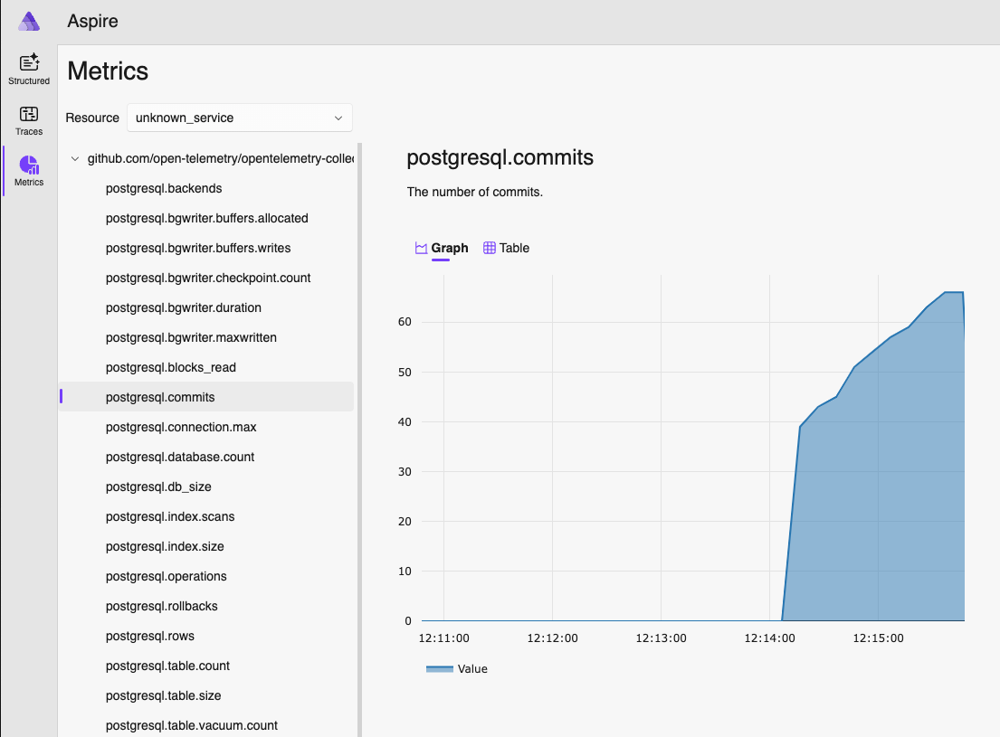
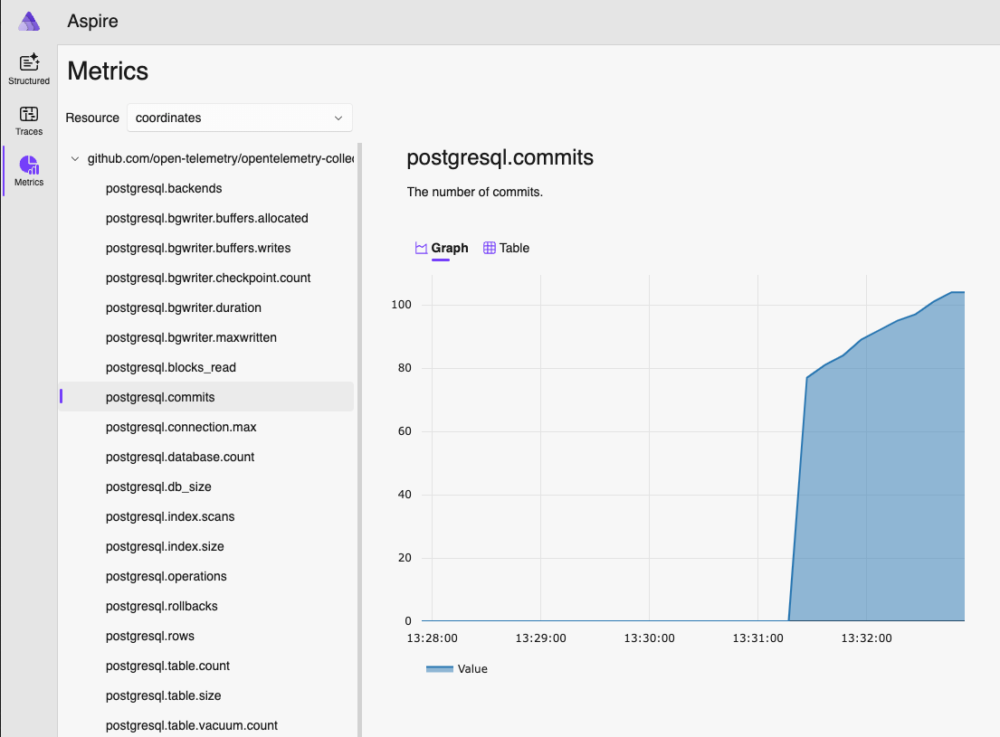

# OpenTelemetry Collector Configuration

In the file [otel-collector-config.yaml](otel-collector-config.yaml).

You will notice that there are 5 sections:

- `receivers`: collect telemetry from one or more sources.
- `processors`: take the data collected by receivers and modify or transform it before sending
it to the exporters.
- `connectors`: consumes data as an exporter at the end of one pipeline and emits data as a receiver at the
beginning of another pipeline.
- `exporters`: send data to one or more backends or destinations.
- `service`: is used to configure what components are enabled in the Collector based on the
configuration found in the receivers, processors, exporters, and extensions sections

## Configuring each component

1. Configuring the `receivers`:
    - To configure the Collector to receive OTLP data in the gRPC and HTTP protocols, we need the following:

      ```yaml
      otlp:
        protocols:
          grpc:
            endpoint: ${env:OTEL_COLLECTOR_HOST}:${env:OTEL_COLLECTOR_PORT_GRPC}
          http:
            endpoint: ${env:OTEL_COLLECTOR_HOST}:${env:OTEL_COLLECTOR_PORT_HTTP}
      ```

    - You may find multiple examples online using `0.0.0.0:4317` and `0.0.0.0:4318` for the endpoints, but
    this is not recommended as it exposes the server to every network interface, which may facilitate
    Denial of Service attacks.

    - We also have a Postgres database in our sample, and we would like to get metrics from it, to do so we can take
    advantage of the `postgresql` receiver:

      ```yaml
      postgresql:
        endpoint: ${env:POSTGRES_HOST}:${env:POSTGRES_PORT}
        username: ${env:POSTGRES_USER}
        password: ${env:POSTGRES_PWD}
        databases:
          - ${env:POSTGRES_DB}
        tls:
          insecure: true
      ```

1. Configuring the `processors`:
    - To better compress the data and reduce the number of outgoing connections required to transmit the data, let's
    use the `batch` processor:

      ```yaml
      batch: {}
      ```

1. Configuring the `connectors`:
    - To aggregate Request, Error and Duration (R.E.D) OpenTelemetry metrics from span data, we can use the
    `spanmetrics` connector:

      ```yaml
      spanmetrics: {}
      ```

1. Configuring the `exporters`:
    - To export data in the `OTLP` format and also have some log entries to every time something is exported,
    we can use the `otlp` and `debug` exporters.

      ```yaml
      debug: {}
      otlp:
        endpoint: "aspire-dashboard:18889"
        tls:
          insecure: true
      otlp/jaeger:
        endpoint: "jaeger:4317"
        tls:
          insecure: true
      ```

> [!NOTE]
> As `otlp` is used to export data to Aspire and Jaeger, we need to add an alias to it, as we need 
to configure it twice.

1. Configuring the `service`:
    - Up until now we have just defined the components our Collector will use, but they are not enabled yet.
    To do so, we need to define our pipelines:

      ```yaml
      pipelines:
        traces:
          receivers: [otlp]
          processors: [batch]
          exporters: [debug, otlp, otlp/jaeger, spanmetrics]
        metrics:
          receivers: [otlp, postgresql, spanmetrics]
          processors: [batch]
          exporters: [debug, otlp]
        logs:
          receivers: [otlp]
          processors: [batch]
          exporters: [debug, otlp]  
      ```

> [!NOTE]
> As Jaeger only supports Traces, we are just using it on the `exporters` for the Traces pipeline.
>
> Another point to highlight is the `spanmetrics` connector. Connectors join two pipelines by using
the end of one pipeline as an exporter, while acting as a receiver for the start of a second pipeline.

## Configuring the `compose.yaml` file

To setup the `OTLP` and `postgresql` receivers we took advantage of environment variables. To ensure the
components will have all data they need to startup, we need to pass those environment variables to the
`otel-collector` service in the `compose.yaml` file.

1. Navigate to [../../compose.yaml](../../compose.yaml#L50) and add the following environment variables:

    ```yaml
    environment:
      - OTEL_COLLECTOR_HOST=otel-collector
      - OTEL_COLLECTOR_PORT_GRPC=4317
      - OTEL_COLLECTOR_PORT_HTTP=4318
      - POSTGRES_HOST=coordinates-db
      - POSTGRES_PORT=5432
      - POSTGRES_USER=postgres
      - POSTGRES_PWD=password
      - POSTGRES_DB=coordinates
    ```

## Starting the application

To start the application, navigate to the `lab/` folder and run:

```sh
docker compose up
```

This will pull all required images and start all services.

If your configuration file is correctly setup, you should start seeing some log entries like this:

```sh
otel-collector-1    | 2025-01-21T11:26:41.579Z  info  Metrics {"kind": "exporter", "data_type": "metrics", "name": "debug", "resource metrics": 4, "metrics": 19, "data points": 33}
```

> [!WARNING]
> If you see any of the following error messages:
>
> - `Error: invalid configuration`
> - `Error: failed to build pipelines`
> - `Error: failed to resolve config`
>
> This means the `otel-collector-config.yaml` file is incorrectly configured.
  Check out the [complete file below](#final-file).

## Checking Postgres Metrics

The log entries we are seeing above are from the `postgresql` receiver. The collector is querying the
Postgres service and sending the metrics to Aspire Dashboard.

Navigate to <http://localhost:18888/> and check out the Metrics tab, you should see an `unknown_service`
listed.



Why `unkown_service` though?

Can we solve this?

### Adding the `transform` processor

The transform processor modifies telemetry based on configuration using the OpenTelemetry Transformation
Language ([OTTL](https://github.com/open-telemetry/opentelemetry-collector-contrib/tree/main/pkg/ottl)).

The processor takes a list of conditions and statements associated to a Context type and executes the
conditions and statements against the incoming telemetry.

Each condition and statement can access and transform telemetry using functions and allow the use of
a condition to help decide whether the function should be executed.

Let's add the `transform` processor to the Collector configuration:

1. Add the following to the `processors` section:

    ```yaml
    transform:
      error_mode: ignore
      metric_statements:
        - context: scope
          conditions:
            - name == "github.com/open-telemetry/opentelemetry-collector-contrib/receiver/postgresqlreceiver"
          statements:
            - set(resource.attributes["service.name"], "${env:POSTGRES_DB}")
    ```

    This is taking all metrics that have the name
    `github.com/open-telemetry/opentelemetry-collector-contrib/receiver/postgresqlreceiver`
    and setting the `service.name` to the value coming from the environment variable `POSTGRES_DB`.

1. And modify the `service.pipelines.metrics.processors` to add the `transform` to the list:

    ```yaml
    processors: [transform, batch]
    ```

> [!NOTE]
> As the Collector is only fetching metrics from the postgres service, we will only apply the `transform`
to the metrics pipeline.

### Rerunning the application

If you have the application still running, you can press `Ctrl+C` to terminate all containers.

Once everything stops, you can run it again navigating to the `lab/` folder and running:

```sh
docker compose up
```

Now, when navigating to the Aspire Dashboard, you should see a Resource called: `coordinates`:



## Final file

<!-- markdownlint-disable MD033 -->
<br>
<details>
  <summary>
    <b>Click here for the completed</b> <code>otel-collector-config.yaml</code>:
  </summary>

```yaml
receivers:
  otlp:
    protocols:
      grpc:
        endpoint: ${env:OTEL_COLLECTOR_HOST}:${env:OTEL_COLLECTOR_PORT_GRPC}
      http:
        endpoint: ${env:OTEL_COLLECTOR_HOST}:${env:OTEL_COLLECTOR_PORT_HTTP}
  postgresql:
    endpoint: ${env:POSTGRES_HOST}:${env:POSTGRES_PORT}
    username: ${env:POSTGRES_USER}
    password: ${env:POSTGRES_PWD}
    databases:
      - ${env:POSTGRES_DB}
    tls:
      insecure: true

processors:
  batch: {}
  transform:
    error_mode: ignore
    metric_statements:
      - context: scope
        conditions:
          - name == "github.com/open-telemetry/opentelemetry-collector-contrib/receiver/postgresqlreceiver"
        statements:
          - set(resource.attributes["service.name"], "${env:POSTGRES_DB}")

connectors:
  spanmetrics: {}

exporters:
  debug: {}
  otlp:
    endpoint: "aspire-dashboard:18889"
    tls:
      insecure: true
  otlp/jaeger:
    endpoint: "jaeger:4317"
    tls:
      insecure: true

service:
  pipelines:
    traces:
      receivers: [otlp]
      processors: [batch]
      exporters: [debug, otlp, otlp/jaeger, spanmetrics]
    metrics:
      receivers: [otlp, postgresql, spanmetrics]
      processors: [transform, batch]
      exporters: [debug, otlp]
    logs:
      receivers: [otlp]
      processors: [batch]
      exporters: [debug, otlp]

```

</details>
