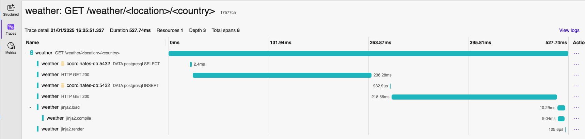
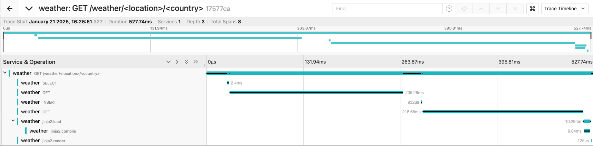
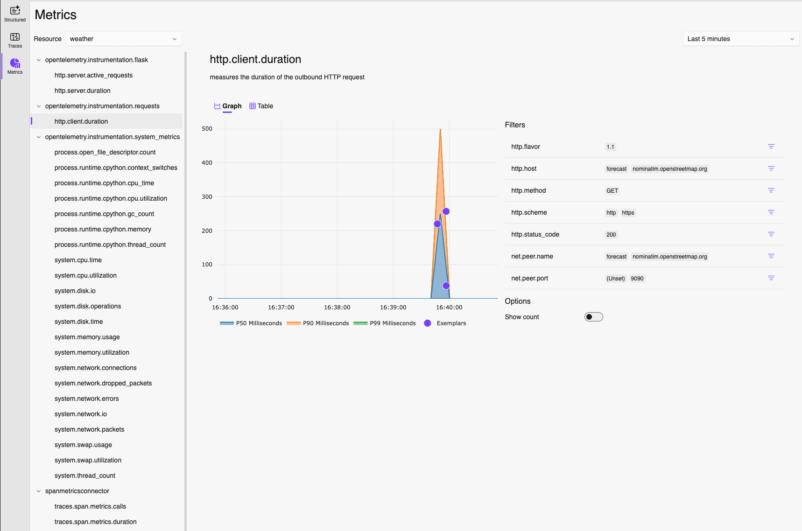
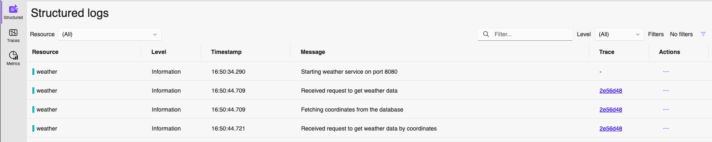
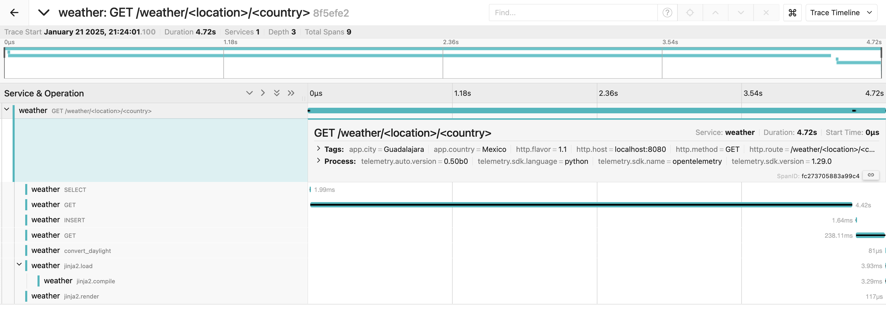

# Weather Service Instrumentation

The Weather service is written in Python. In this section, we will
add everything needed to instrument it and obtain traces, metrics, and logs
in the OTLP format, which will be sent to the OTel Collector configured
in the previous step.

## Adding dependencies

1. Navigate to [requirements.txt](requirements.txt) and add the following dependencies:

    ```txt
    opentelemetry-distro==0.50b0
    opentelemetry-exporter-otlp-proto-grpc==1.29.0
    psutil==6.1.1
    ```

    OpenTelemetry distro provides a mechanism to automatically configure some of the more
    common options for users. In our case, it helps bootstrap the whole instrumentation.

    We are also using the `opentelemetry-exporter-otlp-proto-grpc` to export the collected
    data in `OTLP` format via `gRPC`.

    When `psutil` is used together with the `distro`, it gets the system metrics
    from the service.

1. Now that we have the required dependencies, we can navigate to the
[Dockerfile](Dockerfile#L33) and modify the `runtime` stage to run the
`opentelemetry-bootstrap` install and call `opentelemetry-instrument` when
starting the Weather service.

    ```dockerfile
    RUN opentelemetry-bootstrap -a install

    ENTRYPOINT [ "opentelemetry-instrument", "python", "app.py" ]
    ```

    This will bootstrap the OpenTelemetry instrumentation for the service, but we still
    need to define where to send the data.

1. Navigate to the [../../compose.yaml](../../compose.yaml) file and add the following
environment variables to the weather service:

    ```yaml
    - OTEL_EXPORTER_OTLP_ENDPOINT=http://otel-collector:4317
    - OTEL_SERVICE_NAME=weather
    ```

    This tells the OTel SDK configured by the distro that the OTLP data should be sent to
    `http://otel-collector:4317`, which is the `gRPC` endpoint of the OTel Collector.

    It also defines the service name, so all data produced by this service will have `weather`
    as its name.

## Building the service

If you have the application still running, you can press `Ctrl+C` to terminate all containers.

Once everything stops, you can navigate to the `lab/` folder and run:

```sh
docker compose build weather
```

And when the build ends, run the application:

```sh
docker compose up
```

## Navigating to the application and its data

Open a browser and navigate to <http://localhost:8080/weather/Valencia/Philippines>, or any
other `city/country` you would like to see the weather data about.

After accessing the page, you can visualize the Traces in either:

- Aspire: <http://localhost:18888/traces>

    

- Jaeger: <http://localhost:16686/>

    

**This is to showcase that you can send the exact same data to different tools and get different
visualizations out of it.**

As the Weather service is also producing metrics, we can navigate to <http://localhost:18888/metrics/>
and visualize the metrics for the service:



## Adding the OTel logs bridge

As logs are still in the experimental phase in OpenTelemetry for Python, the distro is not automatically
setting it up. In order to do it, we need to adjust the [logger.py](logger.py) file.

1. First, we need to add the required imports to the file:

    ```python
    from opentelemetry._logs import set_logger_provider
    from opentelemetry.exporter.otlp.proto.grpc._log_exporter import (
        OTLPLogExporter,
    )
    from opentelemetry.sdk._logs import LoggerProvider, LoggingHandler
    from opentelemetry.sdk._logs.export import BatchLogRecordProcessor
    ```

1. And then, we replace the `initLogger` with the following:

    ```python
    def initLogger(service_name):
        logger_provider = LoggerProvider()
        set_logger_provider(logger_provider)
        log_exporter = OTLPLogExporter(insecure=True)
        logger_provider.add_log_record_processor(BatchLogRecordProcessor(log_exporter))
        handler = LoggingHandler(level=logging.INFO, logger_provider=logger_provider)

        logger = logging.getLogger(service_name)
        logger.addHandler(handler)
        logger.setLevel(logging.INFO)
        return logger
    ```

1. If you have the application still running, you can press `Ctrl+C` to terminate all containers.

1. Once everything stops, you can navigate to the `lab/` folder and run:

    ```sh
    docker compose build weather
    ```

1. And, run the application:

    ```sh
    docker compose up
    ```

1. With the application running, navigate to the weather page <http://localhost:8080/weather/Linz/Austria>,
and check the received logs in Aspire at <http://localhost:18888/structuredlogs>:

    

## Extra configuration

Usually the out-of-the-box instrumentation gives us general visibility into the services, but it
lacks contextual and business specific data.

To solve that we can take advantage of manual instrumentation.

With manual instrumentation, we can create metrics, add more context to spans, create new spans and so on.

`opentelemetry-distro` already brings all dependencies we need to add manual instrumentation
to the weather service.

1. Open the [app.py](app.py) file, and add the following import:

    ```python
    from opentelemetry import trace
    ```

1. In the `main` function add the initialization of `tracer`:

    ```python
    if __name__ == "__main__":
        service_name = os.getenv("OTEL_SERVICE_NAME")
        tracer = trace.get_tracer_provider().get_tracer(service_name)
    ```

    Tracer is responsible for creating spans.

1. Now that we have a `tracer`, we can use it to create or modify spans. Let's add some
context to the span which is created when `/weather/<location>/<country>` is called:

    ```python
    current_span = trace.get_current_span()
    current_span.set_attributes({
        "app.city": location,
        "app.country": country
    })
    ```

    `current_span` gets the automatically created span and adds two attributes to it.

1. Let's say we want to keep track of how much time `convert_daylight_duration` is taking to
do its conversion. We can create a new span whenever this function is called:

    ```python
    def convert_daylight_duration(daylight_duration):
    with tracer.start_as_current_span("convert_daylight") as span:
        span.set_attribute("daylight_duration", daylight_duration)
        hours = int(daylight_duration // 3600)
        minutes = int ((daylight_duration % 3600) // 60)

        span.set_status(trace.Status(trace.StatusCode.OK))
        return f"{hours}h {minutes}min"
    ```

    `with tracer.start_as_current_span("convert_daylight") as span` will create a span
    named `convert_daylight` whenever the function is called, the span will have the
    `daylight_duration` manual attribute, and its status set to `OK`.

1. Let's rebuild and rerun the weather service to see those changes. If you have the application
still running, you can press `Ctrl+C` to terminate all containers.

1. Once everything stops, you can navigate to the `lab/` folder and run:

    ```sh
    docker compose build weather
    ```

1. And, run the application:

    ```sh
    docker compose up
    ```

1. With the application running, navigate to the weather page <http://localhost:8080/weather/Guadalajara/Mexico>,
and check the received trace in Aspire <http://localhost:18888/traces> or Jaeger <http://localhost:16686/>:

    

    We can now see the `app.city` and `app.country` attributes in our root span and the extra `convert_daylight`
    span in our trace.
